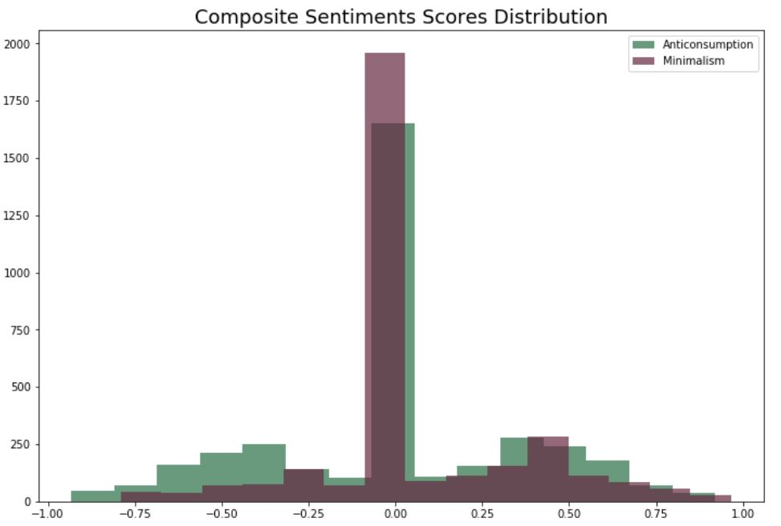
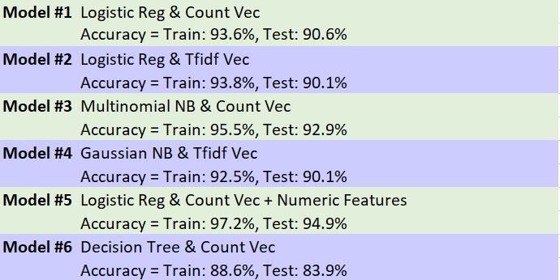
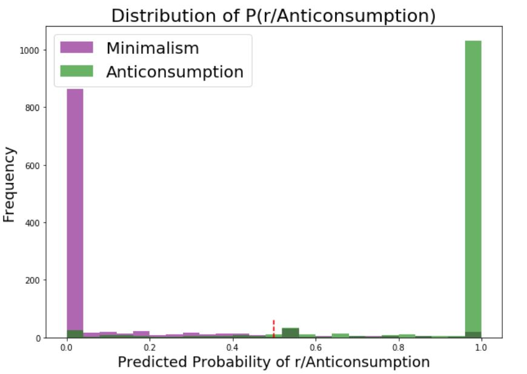
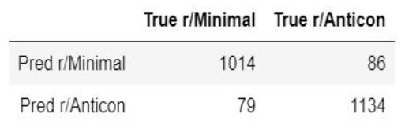
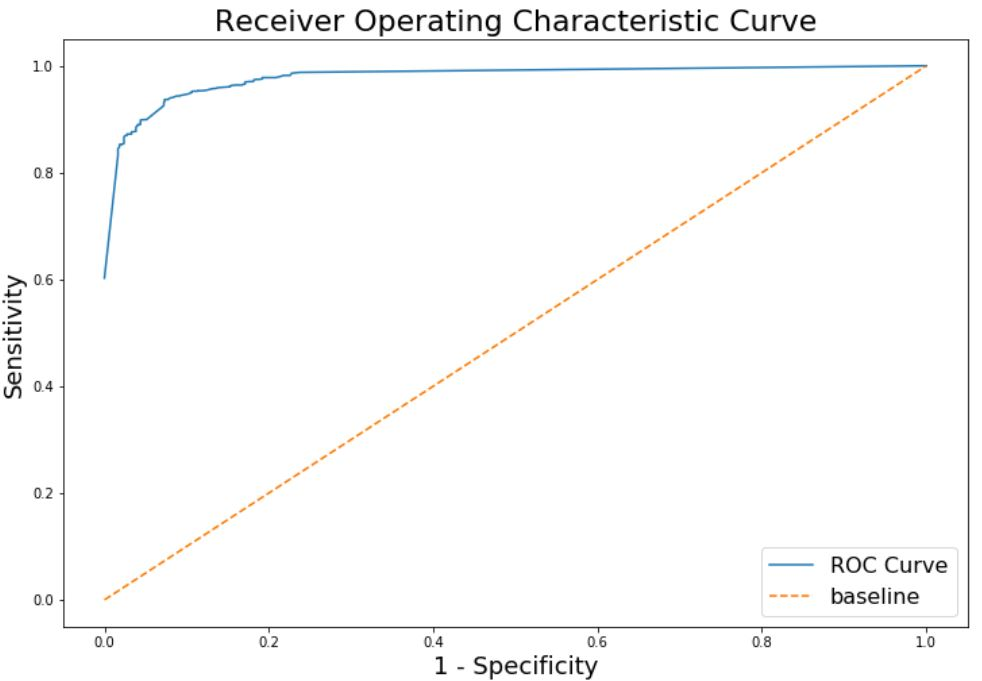


# Project 3: Reddit Web APIs & NLP Classification

### Problem Statement

I will use Reddit’s data to build a classification model, predicting which subreddit a particular post belongs to, in order to aid several environmental organizations to create more influential campaigns.

### Overview

I selected “r/Anticonsumption” and “r/minimalism” subreddits for this project. Used NLP (Natural Language Processing) techniques to train a binary classification model for most accurate predictions.

My model will provide an automation to read large volume of textual data, interpret it, measure sentiment, and determine the user’s lifestyle choices.

It’s important to distinguish people’s language and sentiment on both topics to create more influential campaigns that promote consuming consciously and appreciating simplicity. This will lead to a more sustainable future for the planet.

### Repository

The repository consists of four Jupyter notebooks with my analysis, a folder named csv_folder with data files, a short presentation outlining my process and findings, and this README file for the executive summary.

Jupyter notebooks are listed below with a brief summary of their content:

**Part 1 - Reddit Data Collection**

This notebook focuses on collecting posts from two subredits (r/Anticonsumption and r/minimalism) using the Python Reddit API Wrapper (PRAW).
In order to use the API, we need to create a credentials file in .json format. The file has to contain a dictionary with key-value pairs of "id", "secret", "username" and "pasword" information.
This information can be obtain via Reddit user account settings. (https://www.reddit.com/)

The dataset contains information (post titles, post texts, total upvotes, total comments, create date) on newest submissions collected through Reddit’s Web API.

7009 documents (rows) and 5 features (columns) of said info.

**Part 2 - Reddit Data Cleaning & EDA**

This notebook focuses on data cleaning, exploratory data analysis (EDA) on Anticonsumption and Minimalism subreddits we have previously scraped.  
✓  Merged 6 scraped data files, removed duplicates  
✓  Vectorized text, identified most correlated words  
✓  Plotted several charts to see relationships between features  
✓  Added new column for composite sentiment score  

**Part 3 - Reddit NLP Pre-processing & Modeling**

Pre-processing:
I created function to process and optimize the data to get best performance from models.  

✓  Removed English stop words from documents  
✓  Removed custom stop words such as subreddit name etc.  
✓  Removed HTML tags  
✓  Removed non-letter characters  
✓  Lemmatize words (WordNet Lemmatizer)  

**Sentiment Analysis**

 

Classification Modeling:
I generated several Logistic Regression, Multinomial NB, Gaussian NB, Decision Tree, and Random forest estimator models combining with several preprossesing transformers. Using Pipeline and GridSearch allowed me to run several models with least lines of code in order to come up with best combination.  

Model 1- Count Vectorizer & Logistic Regression  
Accuracy Score = Train: 93.6%, Test: 90.6%  
Model 2- Tfidf Vectorizer & Logistic Regression   
Accuracy Score = Train: 93.8%, Test: 90.1%  
Model 3- Count Vectorizer & Multinomial Naive Bayes  
Accuracy Score = Train: 95.5%, Test: 92.9%  
Model 4- Tfidf Vectorizer & Gaussian Naive Bayes      
Accuracy Score = Train: 92.5%, Test: 90.1%  
Model 5- Function Transformer & Count Vectorizer & Logistic Regression (text and numeric data)   
Accuracy Score = Train: 97.2%, Test: 94.9%   
Model 6- Count Vectorizer & Decision Tree   
Accuracy Score = Train: 88.6%, Test: 83.9%  

  

My fifth model, logistic regression with count vectorizer transformer, performed the best as composite sentiment score was chosen as a numerical feature that has substential coefficient weight in classification.

  

Sensitivity and Specifity scores are close to each other which means our predicted false positives and false negatives are balanced.

 

**ROC Curve**

 

### Summary
- People’s language, sentiment, and behaviour from textual content can be
classified by choosing right techniques
- As the model learns from new data, its performance improves
- Top words can be good resource for environmental campaigns to understand
people’s needs and tendencies

### Recommendations
- Collect more data
- Spend more time with current features
- Engineer new features such as comments, upvotes ratio etc.
- Research and implement additional lemmatizing techniques
